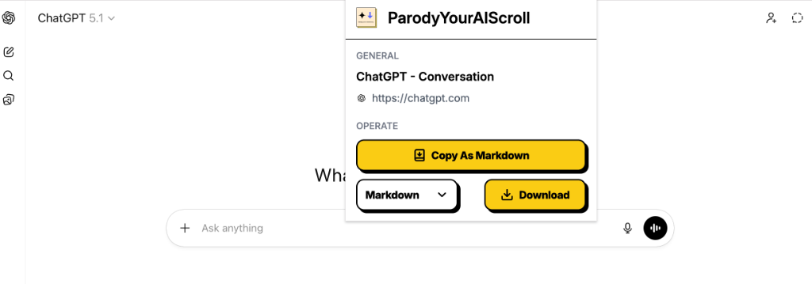

# ParodyYourAIScroll

A Chrome extension to export AI conversations from Google AI Studio and ChatGPT.

## Inspiration & Motivation

Inspired by [YourAIScroll](https://www.youraiscroll.com/).

I created this "parody" version because I found the original tool's support for **Google AI Studio** to be unstable. specifically:

- The scrolling and scraping functionality often fails with **long context** conversations due to complex DOM manipulations.
- Some essential features are locked behind a paywall.

**ParodyYourAIScroll** is designed to be a free, robust alternative that handles long context exports reliably.

## Features

- ✅ Export conversations from Google AI Studio
- ✅ Export conversations from ChatGPT
- ✅ Support for Markdown and JSON formats
- ✅ Clean, modern UI with Inter font
- ✅ Auto-scroll to capture full conversation history

## Installation

1. Download this repository
2. Open Chrome and go to `chrome://extensions/`
3. Enable "Developer mode" (top right)
4. Click "Load unpacked"
5. Select this extension folder

## Supported Platforms

- **Google AI Studio** - https://aistudio.google.com
- **ChatGPT** - https://chatgpt.com

## Usage

1. Navigate to AI Studio or ChatGPT
2. Click the extension icon
3. Choose your export format (Markdown or JSON)
4. Click "Export" to download or copy to clipboard

## Development

Built with:

- Chrome Extension Manifest V3
- Inter Variable Font
- Vanilla JavaScript, HTML, CSS

## License

MIT
