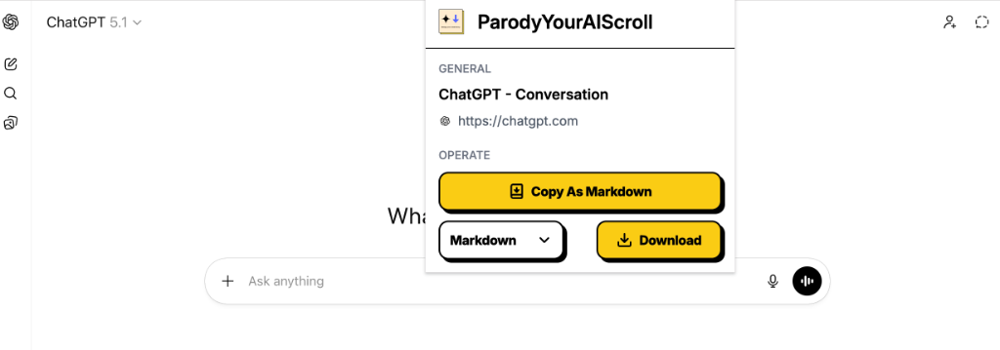
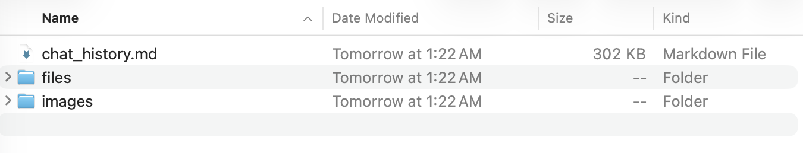
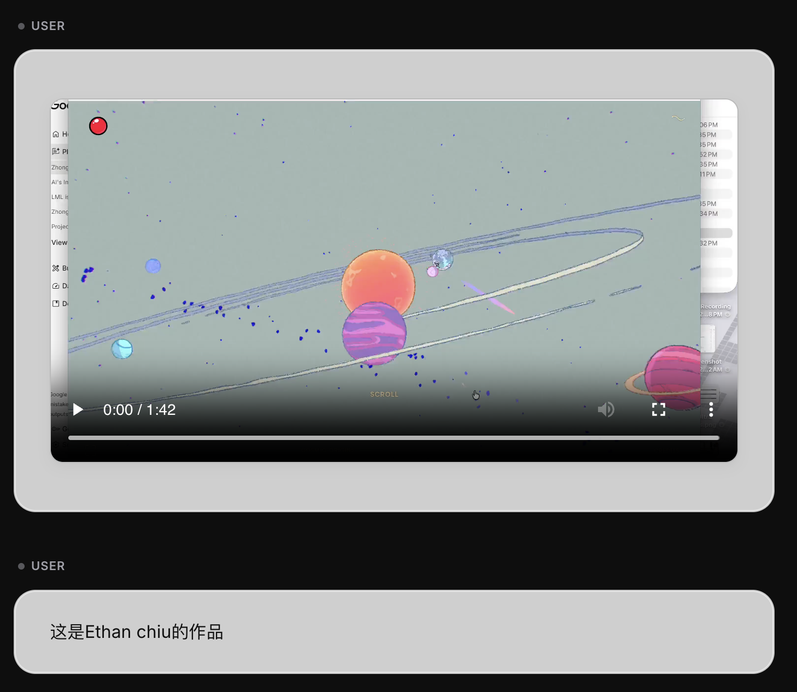

# ParodyYourAIScroll

[中文文档](README_CN.md) | [English](README.md)

A Chrome extension to export AI conversations from Google AI Studio, ChatGPT, Gemini, Claude, and Qwen.

## Inspiration & Motivation

Inspired by [YourAIScroll](https://www.youraiscroll.com/).

I created this "parody" version because I found the original tool's support for **Google AI Studio** to be unstable. specifically:

- The scrolling and scraping functionality often fails with **long context** conversations due to complex DOM manipulations.
- Some essential features are locked behind a paywall.

**ParodyYourAIScroll** is designed to be a free, robust alternative that handles long context exports reliably.

## Features

- ✅ Export conversations from Google AI Studio
- ✅ Export conversations from ChatGPT
- ✅ Export conversations from Gemini (with Thoughts content)
- ✅ Export conversations from Claude
- ✅ Export conversations from Qwen (messages, thinking summaries, web sources, and attachment links)
- ✅ Batch-download recent Qwen conversations as one ZIP (10/20/50/custom)
- ✅ Support for Markdown and JSON formats
- ✅ Clean, modern UI with Inter font
- ✅ API/RPC-first export for Google AI Studio, ChatGPT, Gemini, Claude, and Qwen
- ✅ Auto-scroll fallback when an authenticated data request is unavailable
- 🚀 **Smart ZIP Package Export** - Download conversations with all embedded media (images, videos) automatically packaged!

### 🎯 Smart ZIP Package Export

One of the most powerful features of ParodyYourAIScroll is the **intelligent ZIP packaging system**. Unlike other export tools that only save text, this extension:

- **Automatically detects and downloads** all images and videos from your conversation
- **Preserves original filenames** for easy identification
- **Rewrites Markdown links** to point to local files in the ZIP archive
- **Handles large files** through chunked transfer mechanism (bypassing Chrome's message size limits)
- **Works with Blob URLs** - even temporary media URLs are captured and saved

Perfect for archiving visual conversations, preserving tutorials with screenshots, or backing up important discussions with multimedia content.

_Example: Exported ZIP containing chat history + all embedded images and videos_

### 🎨 Beautiful HTML Export

Export your conversations as **self-contained HTML files** with a gorgeous Cursor-inspired design:

- **Dark IDE aesthetic** - Model responses styled like a code editor window
- **Glass-morphism effects** - Modern, premium UI with subtle transparency
- **Embedded media** - All images and videos are converted to base64 and embedded directly
- **Offline-ready** - No external dependencies, works without internet
- **Expandable thinking blocks** - Click to reveal AI's reasoning process

_Example: Exported HTML with rich media, beautiful typography, and dark theme_

## Installation

1. Download this repository
2. Open Chrome and go to `chrome://extensions/`
3. Enable "Developer mode" (top right)
4. Click "Load unpacked"
5. Select this extension folder

## Supported Platforms

- **Google AI Studio** - https://aistudio.google.com
- **ChatGPT** - https://chatgpt.com
- **Gemini** - https://gemini.google.com
- **Claude** - https://claude.ai
- **Qwen** - https://chat.qwen.ai

## Usage

1. Navigate to AI Studio, ChatGPT, Gemini, Claude, or a specific Qwen conversation
2. Click the extension icon
3. Choose your export format (Markdown or JSON)
4. Click "Export" to download or copy to clipboard

For Google AI Studio, reload the saved prompt once after installing or updating
the extension. The extension then reuses AI Studio's authenticated, read-only
MakerSuite RPC to export the full prompt without scrolling. Unsaved `new_*`
prompts and unavailable RPC sessions automatically use the DOM fallback.
Pasted-text attachments are read from their Drive-backed file IDs in the page's
authenticated session and inlined into the export; access tokens never leave
the page bridge or appear in exported files. Both AI Studio `fetch` and XHR
request transports are retained so Drive attachment access uses the same signed-in
request context as the prompt. Attachment success and failure counts are included
in export metadata. The AI Studio popup includes a remembered **Attachment text**
switch: turn it off to keep attachment references without requesting Drive content.
Attachment metadata and text are fetched with bounded concurrency and cached in
the page bridge for faster repeat exports.

For Qwen, open a specific `/c/<conversation-id>` conversation and refresh the
page once after installing or updating the extension. The extension reads the
authenticated `/api/v2/chats/<conversation-id>` history response, including the
current branch, thinking summaries, web-search sources, and uploaded image/video
links. If Qwen's request security layer blocks a direct read, the page bridge
replays the already captured read-only request without exposing cookies or
security headers to the extension content script. A rendered-page fallback is
kept for sessions where neither API route is available.
Qwen also supports recent-conversation batch export. The popup can package the
latest 10, 20, 50, or a custom count (up to 500) into one ZIP, with one selected
Markdown, JSON, HTML, or text export per conversation plus `_manifest.json`.

## Development

Built with:

- Chrome Extension Manifest V3
- Inter Variable Font
- Vanilla JavaScript, HTML, CSS

## License

MIT
