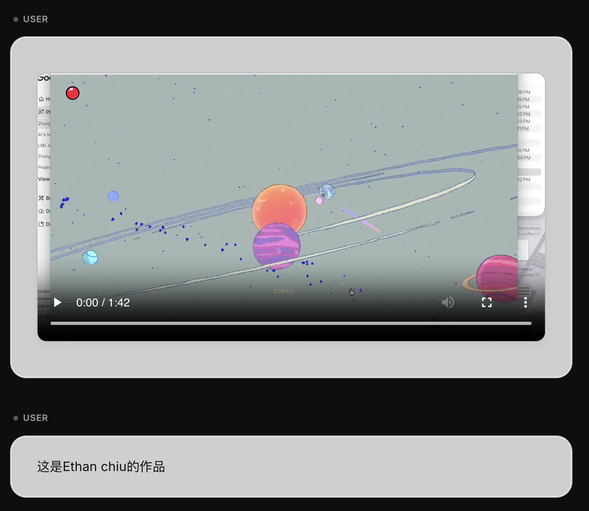

# ParodyYourAIScroll

[English](README.md) | [中文文档](README_CN.md)

一款用于从 Google AI Studio、ChatGPT 和 Gemini 导出 AI 对话记录的 Chrome 扩展插件。

## 💡 灵感与动机

本项目灵感来自于 [YourAIScroll](https://www.youraiscroll.com/)。

我之所以制作这个"Parody"（戏仿）版本，是因为我发现原版工具在支持 **Google AI Studio** 时不够稳定，具体表现为：

- 在处理**长上下文**对话时，由于复杂的 DOM 操作，其滚动和抓取功能经常失效。
- 一些基础的核心功能需要付费才能使用。

**ParodyYourAIScroll** 旨在成为一个免费、稳健的替代方案，专注于可靠地处理长对话的导出。

## ✨ 主要功能

- ✅ 支持从 **Google AI Studio** 导出对话
- ✅ 支持从 **ChatGPT** 导出对话
- ✅ 支持从 **Gemini** 导出对话（支持导出思考/Thoughts 内容）
- ✅ 支持导出为 **Markdown** 和 **JSON** 格式
- ✅ 干净、现代的 UI 界面（采用 Inter 字体）
- ✅ 自动滚动功能，确保捕获完整的对话历史
- 🚀 **智能 ZIP 打包导出** - 自动下载并将对话中嵌入的所有媒体文件（图片、视频）打包！

### 🎯 智能 ZIP 打包导出

**智能 ZIP 打包系统**是 ParodyYourAIScroll 最强大的功能之一。与那些仅能保存文本的普通导出工具不同，本扩展可以：

- **自动检测并下载**对话中出现的所有图片和视频
- **保留原始文件名**，方便识别和查找
- **自动重写 Markdown 链接**，使其直接指向 ZIP 包内的本地文件
- **支持大文件处理**，通过分块传输机制绕过 Chrome 的消息大小限制
- **支持 Blob URL** - 即使是临时的媒体链接也能被完美捕获并保存

这一功能非常适合用于归档可视化对话、保存带有截图的教程，或者备份包含多媒体内容的重要讨论。

_示例：导出的 ZIP 包中包含了聊天记录以及所有的图片和视频文件_

### 🎨 精美的 HTML 导出

您可以将对话导出为**独立的 HTML 文件**，享受类似 Cursor 编辑器的精美设计：

- **深色 IDE 美学** - 模型回复的样式采用了代码编辑器风格
- **毛玻璃特效** - 现代、高级的 UI 设计，带有细腻的透明质感
- **内嵌媒体资源** - 所有图片和视频均转换为 base64 编码直接嵌入 HTML 中
- **离线可用** - 无需任何外部依赖，断网状态下也能完美查看
- **可展开的思考块** - 点击即可展开或折叠 AI 的推理/思考过程

_示例：包含丰富媒体资源、精美排版和深色主题的 HTML 导出效果_

## 📦 安装步骤

1. 下载或克隆本仓库的代码到本地
2. 打开 Chrome 浏览器，在地址栏输入并访问 `chrome://extensions/`
3. 开启右上角的 "**开发者模式**" (Developer mode)
4. 点击左上角的 "**加载已解压的扩展程序**" (Load unpacked)
5. 选择包含本扩展文件的文件夹（即本项目的根目录）

## 🌐 支持平台

- **Google AI Studio** - https://aistudio.google.com
- **ChatGPT** - https://chatgpt.com
- **Gemini** - https://gemini.google.com

## 📖 使用指南

1. 打开 AI Studio, ChatGPT 或 Gemini 网页并进入任意对话
2. 点击浏览器右上角的插件图标
3. 选择您需要的导出格式（Markdown, JSON 或 HTML）
4. 点击 "**Export**" 按钮进行下载，或复制内容到剪贴板

## 🛠️ 技术栈

- Chrome Extension Manifest V3
- Inter Variable Font
- Vanilla JavaScript, HTML, CSS

## 📄 许可证

MIT
